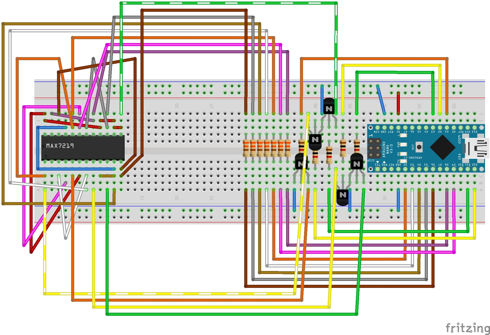

# Display4digits
#### MX4-301 display manager for Arduino

This solution contains a project to manage a 4 digits 7 segments common cathode LED display.

A class with samples and a simple .ino sketch is included

## Wiring

This is the schema using an Arduino Nano

You can also [download the Fritzing source](Schematics/BaseDisplay.fzz)

## Software

Software is developed using [Microsoft Visual Studio 2019 (community edition)](https://visualstudio.microsoft.com/it/vs/)
and [Visual Micro Arduino IDE for Visual Studio](https://www.visualmicro.com/) on
a back-end [Arduino IDE 1.8.10](https://www.arduino.cc/en/Main/Software)

This environment create additional files and directories that can be ignored in the standard Arduino IDE.

Code documentation, generated with Doxygen, is available in the Documentation folder of the repository
or online at https://strawberryfield.github.io/Display4digits/Documentation/html/index.html

## License and Disclaimer

copyright (c) 2019 Roberto Ceccarelli - Casasoft  
http://strawberryfield.altervista.org 
 
This is free software: 
you can redistribute it and/or modify it
under the terms of the GNU General Public License as published by
the Free Software Foundation, either version 3 of the License, or
(at your option) any later version.

This software is distributed in the hope that it will be useful,
but WITHOUT ANY WARRANTY; without even the implied warranty of
MERCHANTABILITY or FITNESS FOR A PARTICULAR PURPOSE.  
See the GNU General Public License for more details.

You should have received a copy of the GNU General Public License
along with these files.  
If not, see <http://www.gnu.org/licenses/>.